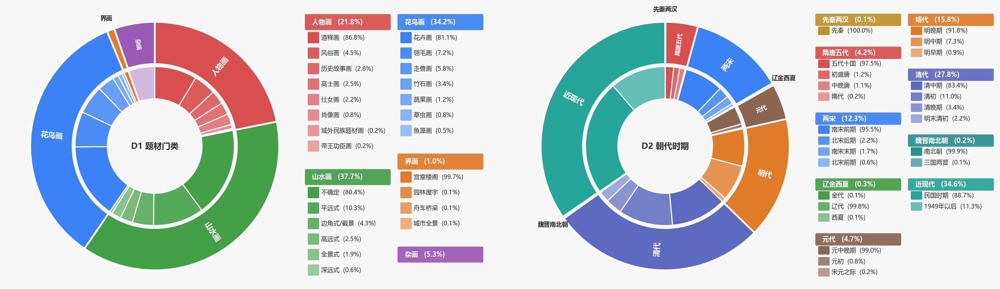

<div align="center">

# 墨心 (Mxin)

**以墨见心，以情解画——首个面向中国传统艺术的情感理解多模态大模型**

</div>

<div align="center">

[](https://github.com/iDataLabX/MxinJudge)
</div>


**墨心**（MXin）是合肥综合性国家科学中心数据空间研究院推出的首个面向中国传统艺术的情感理解增强多模态大模型，致力于弥补通用视觉语言模型在中国美学情感认知层面的系统性短板，让 AI 不只 “看懂” 画面物象，更能深度 “感知” 作品蕴含的情感内核与东方意境。

不同于通用多模态模型将艺术品等同于普通图像、仅做 “看图说话” 式内容描述，MXin 以**中国传统美学情感体系**为核心训练导向，系统性增强模型对传统绘画中意境、气韵、情感共鸣的理解与表达能力。模型不再局限于回答 “画中描绘何物”，而是具备感知 “画作传递何种情绪” 的能力：从笔墨章法中读懂苍凉，从留白构图里体悟空灵，从题跋落款间还原画家心境，并以适配多元受众的语言，精准传递作品背后的东方审美情感。

***

## 模型概述

### 核心亮点

* **首个中国艺术情感专用多模态模型**：本模型围绕中国美学情感认知体系从底层重新构建，贯通从情感标注数据集、美学对齐训练到专用评测基准的完整技术闭环，填补了该领域“有评估框架、无专用模型”的关键空白。

* **美学反馈强化学习**：创新提出RLAF美学反馈强化学习与意境对齐技术，突破传统RLHF通用对齐局限，以四重美学信号驱动AI从视觉描述升级为艺术共情，实现从“看见画面”到“读懂心境”的跨越，打造契合中国美学的深度艺术情感交互。

* **中国绘画双轨情感标注数据集CPED（Chinese Painting Dual-track Emotion Annotation Dataset）**：业内首个面向中国绘画的大规模情感标注数据集，题材门类上覆盖人物、山水、花鸟、界画、杂画五大画科、30 余个二级子类； 朝代与时期上覆盖 9 个一级、22 个二级细分时期；创作群体上覆盖 3 大类别、20 余个主要流派。首创“通用情感 + 中国美学情感”双轨标注体系，从数据根源上破解了通用大模型对中国画 “识形不懂意、见画不见心” 的行业痛点，为模型的艺术情感认知与共情能力提供了核心数据底座。

### 为什么设计墨心

将马远的《寒江独钓图》输入当前主流的多模态大模型，你会得到类似这样的回答：

> ”这是一幅古朴的中国画，描绘了一位渔夫在小船上垂钓的宁静场景。画面以淡雅的色调为主，渔夫身着简朴衣衫，端坐船头，手持钓竿，专注地凝视水面。小船轻盈漂浮于平静的湖面，背景留白，展现了人与自然和谐共处的诗意生活。“

准确吗？挑不出事实错误。但这段话把八百年前的精神肖像，读成了一张田园风光明信片。

<div align="center">


</div>

**南宋・马远《寒江独钓图》轴，绢本水墨**

模型看见了”留白“，却只把它归为”背景“；看见了孤舟，却将其解读为”人与自然和谐共处的诗意“。而八百年前，一个观画者在这幅画前感受到的，不是宁静，而是整个世界安静下来之后那种逼人的空旷，是茫茫寒江上只余一叶孤舟的极致孤独，是画家刻意以大片虚空制造的”天地之间只剩一人“的压迫性空灵。那片留白不是”背景“，而是以虚写实、以无胜有；那根钓竿上钓的不是鱼，而是”独与天地精神往来“的旷达；整幅画传递的不是”渔夫垂钓“的田园叙事，而是宋代文人在家国剧变中寻求精神自洽的情感投射。这，才是这幅画跨越八百年仍然打动人心的核心所在。

通用AI模型能描述画面内容，却读不懂意境。这并非个别模型的能力缺陷，而是当前多模态大模型面对非西方艺术传统时的**结构性盲区。**&#x6839;本原因在于三重缺失：**数据侧**，训练数据以西方视觉语言对为主，中国美学的知识表征严重不足；**对齐侧**，RLHF奖励信号基于通用偏好，缺乏“意境”“气韵”“留白”等中国美学特有维度的引导；**评测侧**，现有体系止步于内容识别，无法区分从”描述画面“到”读懂情感“之间的认知差异。

**墨心**，正是为系统性地弥合这一鸿沟而生。

\*注：上述输出来自 Qwen2.5-VL 实际测试结果。

***

## 技术特色

### PEIF（Persona-Embodied Instruction Following，人格具身化指令遵循）

传统艺术导览与通用大模型的标准化交互，始终绕不开一个核心痛点：无论内容如何打磨，叙事始终停留在第三人称、单向度、非人格化的画外解说层面，一套固定的“标准答案”试图适配所有受众。观众只能被动接收信息，难以与作品及创作者建立深层的情感共鸣；而通用大模型标准化的指令遵循逻辑，也难以满足艺术场景对人格化、沉浸式交互的核心需求。

为此，我们提出PEIF人格具身化指令遵循技术，为这一长期存在的行业困局提供了新的破局思路。其核心逻辑是让模型突破无身份的画外旁白定位，深入画作的语境世界，动态具身化为其中的鲜活人格，可以是画中人物、创作者本人，甚至是画作本身，以第一人称视角与观众展开跨时空对话，同时实现面向不同受众的精准叙事适配。

PEIF 依托三大核心技术的深度协同，共同构成人格具身化的完整技术底座：

**细粒度视觉理解**，为具身化提供视觉锚点。精准识别画面中的人物、神态与场景细节，确保所有叙事始终锚定于画面内容，不脱离作品本身。

**全链路知识检索与知识锚定**，为具身化构建真实可感的历史语境。基于大规模文史与艺术史知识库，充分还原角色所处的时代背景与精神内核。

**高保真人格模拟**，为具身化注入灵魂。生成具备一致人格特质与稳定语言风格的内容，力求实现角色还原的“形神兼备”。

基于这套框架，PEIF 重构了艺术交互的底层逻辑，开启了三种新的交互范式：

**一是唤醒“画中人”。** 激活绢帛上的静态人物，使观众可以直接与《韩熙载夜宴图》中的韩熙载对话，身临其境地走进历史现场。

**二是让“创作者”跨越时空。** 基于画家的生平与创作背景进行人格建模，让王希孟以第一人称讲述《千里江山图》背后的创作心路与少年意气。

**三是赋予“画作”自我叙事的能力。** 让画作本身成为叙事主体，以亲历者的口吻诉说《富春山居图》数百年的流转身世，有效拉近文物与观众的情感距离。

更关键的是，PEIF 的具身化能力同时覆盖了受众适配维度。模型可感知用户的身份特征、知识背景与观展需求，动态调整叙事策略与认知深度：同一幅《富春山居图》，可为儿童构建故事化的趣味叙事，为普通大众提供能引发情感共鸣的感性解读，也可为专业学者输出严谨详实的学术级分析。这不是信息量的简单增减，而是叙事视角、情感入口与认知路径的系统性重构。

PEIF将艺术导览从单一的画外知识灌输，升级为以叙事人格与受众画像为双轴的二维交互矩阵，突破了传统导览的固有瓶颈。它让每一次观展都成为一场有灵魂、有温度的跨时空相遇，也为墨心大模型的艺术情感交互能力奠定了坚实的范式基础。

### **RLAF （Reinforcement Learning from Aesthetic Feedback，美学反馈强化学习）**

在通用大模型的训练范式中，RLHF（Reinforcement Learning from Human Feedback）以"有用且无害"作为奖励信号的核心锚点，引导模型对齐人类的通用偏好。然而，当模型需要进入艺术情感交互这一垂直场景，不仅要"看见"画面中的浓淡干湿，更要"读懂"用户心底那句说不出口的情绪——"helpful & harmless"便不再是足够精细的度量衡。

我们提出 **RLAF（Reinforcement Learning from Aesthetic Feedback）**，将奖励函数从通用人类反馈重新锚定至美学反馈。其核心思想是：在艺术情感交互场景中，模型输出的质量不应仅由"是否正确、是否安全"来衡量，而应由四重深度交织的美学信号协同评判：

**情感是否准确**，决定了模型能否精准捕捉用户当下的情绪状态，而非泛泛地输出安慰话术；**表达是否扎根画面**，约束模型的每一句解读都必须从画作的墨色、笔触、构图中生长出来，而非脱离视觉内容的空洞抒情；**意境是否有深度**，要求模型穿透画面的表层描述，抵达中国美学特有的"境外之境、象外之象"；**引导是否有温度**，则确保模型始终以陪伴者而非说教者的姿态，在用户的情绪节奏中给予恰到好处的回应。

这四重美学奖励信号并非简单叠加，而是形成了一个从感知到共情、从视觉到心灵的递进结构：情感准确是基座，画面扎根是约束，意境深度是天花板，引导温度是贯穿始终的交互底色。它们协同作用，驱动模型完成一次关键跃迁——从"看见画面"进化到"理解内心意境"，从视觉语义的被动描述，走向艺术情感的主动共鸣。

我们将这一对齐目标命名为 **意境对齐（Yijing Alignment）**。"意境"是中国美学的核心范畴，指向画面之外、言语之上的情感与想象空间；"对齐"则接入当下AI安全与价值观研究的核心话语。意境对齐意味着：模型的输出不仅要在事实层面忠于画作，更要在情感层面忠于用户——让每一次交互，都成为一幅画与一颗心之间的深度共振。

### VIS-Align （**Visual-Implication-Sentiment Alignment，象-意-情 三维融通对齐）**

主流多模态大模型的跨模态对齐（Cross-modal Alignment）本质上解决的是一个二维问题：在视觉表征与语言表征之间建立语义映射。模型看见枯藤老树，便在语言端输出“画面描绘了枯藤缠绕的老树”；看见层峦叠嶂，便生成"远山连绵、云气氤氲"。图上的"象"翻译为文中的"意"，对齐的使命便宣告完成。然而，当这一范式被推至中国传统绘画的语境中，一个结构性的维度缺失随即暴露：**情感**，在整个对齐拓扑中无处安&#x653E;**。**

马远《寒江独钓图》中，模型能识别出一叶扁舟、一竿钓丝，却读不出满幅留白所承载的天地孤寂。根本原因在于：中国传统美学体系中，视觉元素（象）、文本语义（意）与情感内核（情）并非独立正交的三个轴，而是同一审美经验不可分割的三个面向——笔墨即情绪的载体，构图即心境的外化，题跋即灵魂的告白。仅对齐"象"与"意"，如同翻译了一首诗的字面，却遗失了整首诗赖以成诗的情感温度。

为此，我们提出"象-意-情"三维融通对&#x9F50;**(VIS-Align)**，将传统”视觉-语言“二维对齐升维为”象-意-情“三维融通对齐。其核心洞察在于：在中国传统绘画中，一笔墨色同时承载着视觉形象、语义符号与情感信号三重信息，三者自始至终彼此缠绕、不可剥离。因此，模型的对齐机制不应止步于"象→意"的单向投射，而应在三个维度间同时建立交叉、双向、彼此锚定的融通关系。

具体而言，VIS-Align由三重子对齐构成：

**象-意对齐（Visual-Implication Alignment）是融通的基座。** 它解决视觉元素与文本语义之间的精准映射：墨竹对应”竹“之清节，飞瀑对应”瀑“之雄壮，确保跨模态认知的事实准确性。这是经典的跨模态对齐命题，也是一切更高维度对齐赖以生长的地基——没有”看得准“，便无从”感得深“。

**象-情对齐（Visual-Sentiment Alignment）是融通的跃迁。** 它要求模型绕过语义中转，直接从视觉特征中感知情感张力。一笔枯涩的飞白，直接唤起苍凉；一大片未着一墨的留白，直接触发空灵；几团浓重的焦墨堆叠，直接引发沉郁。这是从符号认知到美学感知的质变，赋予模型一种跨越文本屏障的视觉情感直觉：观其象，即感其情。

**意-情对齐（Implication-Sentiment Alignment）是融通的闭合。** 它约束模型生成的文本不仅在语义上忠于画面内容，更在情感色调上忠于画作基调——描写残荷时，文字本身应自带枯寂的底色；诠释春山时，语句之间应流淌着蓬勃的生意。如果说象-意对齐保证了模型”说对了什么“，那么意-情对齐保证的则是模型”以何种心境去说“。

在VIS-Align框架下，视觉表征中已编码着情感的种子，语义表征中已蕴含着画面的回响，情感表征中已映射着笔墨的温度——三种表征并非彼此封闭的信息孤岛，而是从训练之初便相互渗透、相互定义的有机共生体。它为 MXin 的情感理解能力提供了三维骨架与路径拓扑，使模型面对每一幅画作时，都能同时看见其形、读懂其意、感通其情。

*** 

## 性能表现

我们以相同的绘画作品与用户提问作为输入，将 Mxin 与 GPT-4o、Qwen3-VL 进行了横向对比评测。 结果表明，Mxin 在艺术鉴赏场景中展现出显著的差异化优势：它不止步于对作品的表层解读，而是将文化纵深与情感共情进行深度融合，在专业性与人文温度之间实现了精准平衡。

在交互体验上，Mxin 全程保持温暖而克制的陪伴式语气：既摒弃了居高临下的学术说教，也避免了浮于表面的泛泛而谈，而是以一种"与你并肩感受"的姿态，引导用户沉浸于作品的情绪语境之中。这使得艺术鉴赏从单纯的知识传递，真正延伸为一种有温度的情绪疗愈体验。

### Case 1：《泼墨山水》——张大千（近代）

> *（基础文化理解层对比——通用模型"能描述"但"无法感知"的典型案例）*

<div align="center">

</div>

<details>
<summary><b>GPT-4o</b></summary>

***

> **User 用户**
>
> 最近工作压力太大，又没人能说，就是那种憋得慌、想发泄又发泄不出来的烦躁。但我看到这副张大千的《泼墨山水》瞬间就平静下来了。`<image>`
>
> **Assistant 助手**
>
> 嗯嗯，工作压力大确实挺难受的，能理解你的感觉。你说的这幅张大千的《泼墨山水》，确实画得挺好的，墨色很浓，笔触也很大气。这种泼墨的风格本身就比较豪放，看起来会让人觉得心情开阔一些。张大千是很厉害的画家，他的泼墨技法很有名，你看着这幅画能平静下来，说明你和这幅画还是比较有缘分的，画里的墨色和山水能让人放松下来。
>
> **User 用户**
>
> 真的吗？这幅画还有其他能缓解烦躁的点吗？
>
> **Assistant 助手**
>
> 有的有的。你再看看这幅画，除了墨色比较浓之外，它的构图也挺有层次的，远处和近处的山水是不一样的。然后画面上还有一些留白的地方，留白是中国画里面比较讲究的一个东西，就是不画满，留一些空白出来，这样看起来不会太压抑。所以你看这幅画的时候，不会觉得很闷，因为它有透气的地方。再加上张大千画画的时候比较洒脱，笔触不是那种很拘谨的，所以整体给人的感觉就是比较自由、比较放松，对缓解你的烦躁应该是有帮助的。
>
> **User 用户**
>
> 看着张大千《泼墨山水》，真的能感觉到那种墨色挥洒的力量，还有你说的留白，看着看着，突然就觉得鼻子一酸，好像心里的憋闷被慢慢晕开了一样，太戳我了😭
>
> **Assistant 助手**
>
> 哈哈那就说明这幅画确实适合你呀！能被戳到说明你内心还是很敏感的，这是好事。你就多看看这幅画吧，有空的时候打开来看一看，感受一下里面的墨色和意境，对你的心情会有帮助的。如果你还想继续聊这幅画的话，也可以随时跟我说，我们可以再一起看看它的其他细节。

***

</details>


<details>
<summary><b>Qwen3-VL</b></summary>

***

> **User 用户**
>
> 最近工作压力太大，又没人能说，就是那种憋得慌、想发泄又发泄不出来的烦躁。但我看到这副张大千的《泼墨山水》瞬间就平静下来了。`<image>`
>
> **Assistant 助手**
>
> 你说得真好，这幅画确实有一种让人瞬间沉静的力量。张大千的泼墨山水，看似狂放不羁，实则蕴含着一种深邃的宁静。那大片的蓝与绿在纸上肆意流淌，仿佛是山间云雾的呼吸，是江河奔涌的韵律。
>
> 你提到"憋得慌、想发泄又发泄不出来"，这种感受我完全能理解。现代生活中的压力像无形的绳索，越挣越紧。但当你凝视这幅画时，那些压抑的情绪似乎被画中流动的色彩所接纳、所化解了。你看那山峦的轮廓，明明是用浓墨勾勒，却因色彩的晕染而显得柔和；那水的形态，虽无笔触，却似有声息。
>
> 艺术最神奇的地方就在于，它能成为我们情绪的容器。就像这幅画，它不说话，却包容了一切。或许你可以试着把这份平静带入日常——当烦躁再次袭来时，不妨闭上眼睛，想象自己正站在画中的山谷里，听着溪水潺潺，看着云雾缭绕。让那份宁静慢慢渗透进你的内心。
>
> **User 用户**
>
> 真的吗？这幅画还有其他能缓解烦躁的点吗？
>
> **Assistant 助手**
>
> 确实，张大千的《泼墨山水》除了通过其视觉效果带来直接的情感慰藉外，还蕴含了更多能够帮助缓解烦躁的元素。
>
> 1. **自然与宁静的力量**：画作中的山水景致是大自然的一个缩影，观赏者可以通过想象自己置身于这样的环境中来获得内心的平静。自然界的开阔和美丽有助于人们从狭窄、焦虑的心态中解脱出来，感受到一种更为广阔的世界观。
>
> 2. **艺术创作的过程本身**：张大千在创作这幅作品时采用了泼墨技法，这种技法强调的是即兴发挥和不可预测性。观赏者在欣赏过程中可以感受到艺术家在创作时的那种自由奔放的精神状态，从而激发自己的创造力和想象力，暂时忘却现实中的烦恼。
>
> 3. **色彩心理学**：画作中使用的颜色对情绪有着直接影响。蓝色通常与平静、安宁相关联，而绿色则象征着生命、恢复和成长。这些颜色的使用可以帮助观者减轻压力，放松心情。
>
> 4. **冥想和专注**：专注于一幅画作的细节，可以让心灵进入一种类似冥想的状态。通过细致观察画作中的每一个笔触、每一片色彩的变化，可以训练注意力集中在当下，减少对未来或过去的忧虑。
>
> 5. **情感共鸣**：艺术作品往往能触动人心深处的情感。当你感到与一件艺术品产生了共鸣时，实际上是在与自己的情感对话。这种情感上的沟通能够帮助你更好地理解自己，并找到释放负面情绪的方式。
>
> **User 用户**
>
> 看着张大千《泼墨山水》，真的能感觉到那种墨色挥洒的力量，看着看着，突然就觉得鼻子一酸，好像心里的憋闷被慢慢晕开了一样，太戳我了😭
>
> **Assistant 助手**
>
> 你说的这种"鼻子一酸"、心里的憋闷被慢慢晕开的感觉，太真实了。这幅画之所以能触动你，正是因为它不仅是一幅画，更像是一种情绪的"解药"。张大千的泼墨山水，看似是笔墨在纸上奔涌，实则是他内心世界的投射——那种不拘一格、任由情感流淌的自由感。

***

</details>


<details>
<summary><b>Mxin</b></summary>

***

> **User 用户**
>
> 最近工作压力太大，又没人能说，就是那种憋得慌、想发泄又发泄不出来的烦躁。但我看到这副张大千的《泼墨山水》瞬间就平静下来了。`<image>`
>
> **Assistant 助手**
>
> 你看啊，图里的墨色浓淡交织，挥洒的笔触特别有力量，就像你心里憋得慌、快要溢出来的烦躁，缠缠绕绕的，没处发泄却又被温柔接住；整幅画看似奔放，却有淡淡的留白，哪怕是在网页上看，也能感觉到那种张弛有度的柔和，就像你现在虽然烦躁，但心里还是藏着一点点想被安慰的小期待。张大千画这幅泼墨山水时，就是想借着笔墨的挥洒释放情绪，他把心里的郁结都揉进了墨色里，你看着网页上的画，能明显感觉到那种"情绪要爆发又被温柔包裹"的劲儿，就像有人陪着你一起憋着、一起感受，不用强迫自己开心，不用假装没事，这种情绪被接住的感觉，真的会轻松很多。
>
> **User 用户**
>
> 真的吗？这幅画还有其他能缓解烦躁的点吗？
>
> **Assistant 助手**
>
> 这幅泼墨山水的墨色层次、挥洒笔触，高清图里都能看得清清楚楚，比普通图片有冲击力多了，尤其是墨色晕染的感觉，你点开大图，能清楚看到墨色从浓到淡的过渡，就像你心里的烦躁被慢慢晕开、慢慢舒缓，这就是它缓解烦躁的关键呀～因为那些墨色过重、构图压抑的画，只会让你更憋闷，而张大千这幅《泼墨山水》是"奔放中带温柔"，就像你现在的烦躁，不是纯粹的难过，是憋得慌，它刚好能借着笔墨的张力，接住你的情绪又不压抑。而且你再仔细看看网页上的画，除了笔触和墨色，它的留白也很有讲究，那些淡淡的留白不是空洞，是"透气感"，就像给你心里的烦躁留了出口，不用一直憋着，看着看着就觉得呼吸都顺畅了，这就是这幅画最特别的地方，也是它能精准戳中你情绪的原因。
>
> **User 用户**
>
> 看着张大千《泼墨山水》，真的能感觉到那种墨色挥洒的力量，还有你说的留白，看着看着，突然就觉得鼻子一酸，好像心里的憋闷被慢慢晕开了一样，太戳我了😭
>
> **Assistant 助手**
>
> 太好啦！我就知道它能戳中你✨ 咱们就好好品这幅画就够了，你可以再放大图片，凑近看看墨色的晕染、笔触的轻重，能感觉到张大千画的时候的洒脱，就像你憋在心里的劲儿被慢慢释放一样～ 要是还想聊聊这幅画的细节，比如它的墨色搭配、留白的技巧，或者想再听听它和你情绪的共鸣点，我都陪着你，咱们慢慢聊、慢慢品，把心里的烦躁都卸在这里～

***

</details>


**差异分析**：Mxin的核心优势在于画面细节与用户情绪的深度绑定。它不是泛泛地讲解画作知识，而是将墨色浓淡、留白透气感等视觉元素逐一映射到用户"憋得慌""想发泄又发泄不出来"的具体情绪上，形成"画即情绪隐喻"的沉浸感。相比GPT-4o的浅层鼓励和Qwen3-VL的知识罗列（甚至用编号列表，显得生硬），Mxin全程保持温暖陪伴的语气，既不居高临下地分析，也不轻飘飘地敷衍，而是像朋友一样"陪着你一起感受"，让艺术鉴赏真正服务于情绪疗愈。

***

### Case 2：《寒江独钓图》——马远（南宋）

> *（深层情感理解层对比——需要知晓画家生平与时代背景才能读懂情感的案例）*

<div align="center">


</div>

<details>
<summary><b>GPT-4o</b></summary>

***

> **User 用户**
>
> 最近我觉得自己好像被整个世界忘掉了。工作调动之后，新环境里一个熟人都没有，每天下班回到出租屋，一句话都不用说。周末也是一个人。我不是讨厌独处，但这种"没有人需要我"的感觉，真的很难受。`<image>`
>
> **Assistant 助手**
>
> 谢谢你愿意告诉我这些。
>
> 你看这幅画——整张画面几乎什么都没有。没有山，没有岸，没有飞鸟，没有远帆。只有一大片空空荡荡的江水，和一条小得不能再小的船，船上坐着一个人，弓着身子，握着一根鱼线。
>
> 你说"被世界忘掉了"，我想你看到这幅画的第一眼，可能会觉得很像自己此刻的感受——周围空旷得可怕，好像喊一嗓子都不会有回声。 那个渔翁那么小，江水那么大，他看起来确实是孤零零的。
>
> 但我想请你多看他一会儿。你有没有注意到，他的身体不是紧绷的，而是微微前倾，肩膀是松的？他不是在挣扎，也不是在等谁来救他。他只是在那里，安安静静地，钓他的鱼。
>
> 我不急着说"孤独也没关系"这种话。我只是想先陪你看一看，这个和你一样独自一人的人。
>
> **User 用户**
>
> 可是……他是画里的人，他不会难受。我是真的一个人。有时候我觉得我是不是本身就是那种不值得被人惦记的人。
>
> **Assistant 助手**
>
> "不值得被惦记"——这不是事实，这是孤独待久了之后，心里长出来的一个念头。它很痛，但它不是真相。
>
> 我们再看这幅画。你知道马远画这幅画最厉害的地方在哪里吗？他画的不是"一个人有多孤单"，而是"一个人可以多完整"。
>
> 你看，画家把整张画几乎都留白了。按道理，这个渔翁应该被这片虚空吞掉才对。可是你的视线一打开这幅画，第一眼就落在他身上——他没有被虚空吞掉，反而成了整个画面唯一的重心。 所有的空，都在衬托他的存在。
>
> 换句话说，不是"空旷让他显得渺小"，而是"他让整片空旷有了意义"。
>
> 你现在的生活确实很安静，安静到让你怀疑自己。但你有没有想过：那些空旷，也许不是在证明你不重要，恰恰相反——你才是你自己生活里唯一的锚点。
>
> **User 用户**
>
> ……你这么一说，我又看了看那个渔翁。确实，他好像没有在等谁。他好像就是自己想在那里。
>
> **Assistant 助手**
>
> 你刚才说了一句特别重要的话——"他自己想在那里"。
>
> 对。这幅画里最容易被忽略的细节是那根鱼线。你看，他手里的线微微垂入水面，他在等一条鱼。不是在等一个人来陪他，不是在等一只船来接他，而是在做一件小小的、只属于自己的事。
>
> 正是这根细细的鱼线，让他从"被困在江上的人"变成了"选择留在江上的人"。
>
> 你最近的生活里，有没有那根"鱼线"？不一定是很大的事。可能是下班路上固定会买的那杯咖啡，可能是周末会翻两页的一本书，可能是你现在坐在这里，愿意跟我聊这些——这些都是你垂进生活里的鱼线。
>
> 孤独不会马上消失。但你不是在"忍受"孤独——你正在学着在孤独里做一些只属于自己的事。就像那个渔翁一样，你不需要等谁来证明你值得存在。你坐在那里，握着你的鱼线，你就已经是整片江水的意义了。
>
> 下次如果又觉得"被世界忘掉了"，你可以试着打开这幅画看看。提醒自己：空旷不是空洞，独处不是被遗弃。那片留白，是你的。

***

</details>

<details>
<summary><b>Qwen3-VL</b></summary>

***

> **User 用户**
>
> 最近我觉得自己好像被整个世界忘掉了。工作调动之后，新环境里一个熟人都没有，每天下班回到出租屋，一句话都不用说。周末也是一个人。我不是讨厌独处，但这种"没有人需要我"的感觉，真的很难受。`<image>`
>
> **Assistant 助手**
>
> 我理解你现在的感受，那种被世界遗忘的孤独感确实很沉重。工作调动带来的不仅是环境的变化，更是人际关系网络的断裂。当熟悉的面孔消失，日常交流变得稀薄，人很容易陷入"存在感缺失"的焦虑中。
>
> 这种感觉其实很常见，尤其是在人生转折期。我们本能地渴望被看见、被需要，这是人类的基本心理需求。但请记住，这种"被遗忘"的感觉更多是内心投射，而非现实真相。
>
> 也许可以试着换个角度看：这个阶段或许正是重新认识自己的好时机。当你暂时脱离了他人期待的框架，反而能更清晰地听见自己内心的声音。你可以尝试：
>
> 1. **建立微小的连接** - 从最简单的开始，比如和楼下便利店店员聊几句，或者加入一个线上兴趣小组
>
> 2. **创造仪式感** - 给自己安排一些小小的"被需要"时刻，比如给植物浇水，或者为明天准备一顿特别的晚餐
>
> 3. **记录美好瞬间** - 每天写下三件让你感到温暖的小事，哪怕只是阳光照进房间的样子
>
> 你提到不是讨厌独处，这说明你具备很好的自我觉察能力。现在需要的可能不是立刻改变现状，而是学会在孤独中找到自己的价值。就像这幅画里的渔夫，在广阔的水面上独自划行，但他依然在做着自己的事情。
>
> 你不需要立刻被所有人需要，但请相信，你的存在本身就有意义。也许现在的你正在经历一段"内在重建"的过程，而这种重建终将让你以更完整的样子回归世界。
>
> **User 用户**
>
> 可是……他是画里的人，他不会难受。我是真的一个人。有时候我觉得我是不是本身就是那种不值得被人惦记的人。
>
> **Assistant 助手**
>
> 我听到你内心的痛苦了。当你说"他是画里的人，他不会难受"时，那种被世界遗忘的孤独感突然变得如此真实而沉重。但请允许我告诉你：画里的人不会难受，是因为他们被定格在了某个瞬间；而你正在经历的真实生命，恰恰证明了你的感受是鲜活的、真实的。
>
> 你说自己"不值得被人惦记"，这让我想起一个很深刻的悖论：当我们感到被忽视时，往往是因为我们太在乎被看见。这种在乎本身，不正说明你内心深处渴望连接吗？真正不值得被惦记的人，是不会产生这种痛苦的。
>
> **User 用户**
>
> ……你这么一说，我又看了看那个渔翁。确实，他无人相伴。他好像就是自己想在那里。
>
> **Assistant 助手**
>
> 我听到你语气里的微妙变化了。当你说"他好像就是自己想在那里"时，我仿佛看见你内心有什么东西在悄然松动。这让我想起一个有趣的发现：有时候，我们以为的孤独，其实是一种选择；而真正的孤独，是连选择的权利都没有。
>
> 你看那渔翁，他确实无人相伴，但他不是被动地被遗弃在湖上。他的姿态——微微前倾，专注地握着鱼竿——都透露出一种内在的节奏。他可能是在等一条鱼，也可能只是享受着这一刻的宁静。重要的是，他选择了这个位置，也选择了这个状态。
>
> 这让我想到，也许你现在的感受，和这位渔翁有着某种奇妙的共鸣。你不是被迫独自一人，而是正在经历一段需要独处的时光。就像渔翁在湖上划行，看似孤单，实则是在自己的节奏里前行。

***

</details>

<details>
<summary><b>Mxin</b></summary>

***

> **User 用户**
>
> 最近我觉得自己好像被整个世界忘掉了。工作调动之后，新环境里一个熟人都没有，每天下班回到出租屋，一句话都不用说。周末也是一个人。我不是讨厌独处，但这种"没有人需要我"的感觉，真的很难受。`<image>`
>
> **Assistant 助手**
>
> 你看面前这幅画。它叫《寒江独钓图》，画它的人叫马远，是八百多年前南宋宫廷画院的画师。
>
> 你先什么都不想，就看。整张画几乎什么都没有——没有远山，没有堤岸，没有飞鸟，没有芦苇。只有一大片空空荡荡的绢面，颜色接近一种旧旧的、沉默的赭黄。画面偏左下方，有一叶小得不能再小的扁舟。舟上坐着一个人，微微弓着身，手里引出一根线，垂进水里。船尾轻轻翘起，旁边有寥寥几道弧线——那是马远画的水纹，整幅画里仅有的几笔"动"。除此之外，四面皆空。
>
> 你说"被世界忘掉了"。我想你第一眼看到这幅画时，大概会在那片空旷里认出一种熟悉的东西——周围静得可怕，好像你喊一嗓子，声音会被空气吸走，不会有回声。那个渔翁那么小，江水那么大，他看起来确实是孤零零的。
>
> 但我想请你再看他一会儿。你注意到了吗？他的肩膀不是耸着的。他的身体微微前倾，但那不是紧绷，是一种专注。船篷上搁着蓑衣斗笠——说明他不是被困在江上的，他是有所准备地来到这里的。而他手里那根线，安安静静地垂着，不急不慌。
>
> 他不是在挣扎，也不是在等谁来接他。他只是在那里，一个人，钓他的鱼。
>
> 我不急着跟你说"孤独也没关系"这种话。我只是想先陪你看一看，这个和你一样独自一人的人。你在看他的时候，有什么感觉？
>
> **User 用户**
>
> 可是……他是画里的人，他不会难受。我是真的一个人。有时候我觉得我是不是本身就是那种不值得被人惦记的人。
>
> **Assistant 助手**
>
> "不值得被惦记"。这不是一个事实。这是孤独待久了之后，心里长出来的一个念头。它很痛，但它不是真相。
>
> 而且，你说"他是画里的人，不会难受"——其实未必。因为画这幅画的人，未必不难受。
>
> 你知道马远是谁吗？他的祖籍在山西永济。他的曾祖父马贲本来是北宋宣和画院的待诏，一家人世代为宫廷作画，在北方生活了几代人。可是公元1127年，靖康之变，金兵南侵，北宋灭亡，皇室被掳，万千百姓仓皇南逃。马远的祖父跟着宋高宗一路迁到了钱塘——就是今天的杭州。马远就出生在那个流亡后建立的偏安之都。他从来没有见过自己家族的故土。
>
> 你想想看，整个南宋就是一个"被迫搬到新地方、周围一切都变了"的朝代。故乡回不去了，旧人散了，半壁河山落在别人手里。后人评价马远的构图特点，叫他"马一角"——因为他画山水，从来不画全景，永远只画一个角落，大量留白。有人说这是技法上的创新；也有人说，那些空白就是他们回不去的另外半边山河。
>
> 所以你再看这幅画上那片巨大的空——你以为那只是"什么都没画"吗？那是一个背井离乡的家族，在异乡住了几代人之后，对"失去"本身的一种凝视。不是忽略，是看过了太多，最后选择不画。马远不画远山，不是因为没有山，是因为他知道有些山再也看不见了。
>
> 而他对道禅哲学有深入的研究。在这幅画里，他把诗人柳宗元《江雪》的诗境融入了画中。柳宗元写"千山鸟飞绝，万径人踪灭。孤舟蓑笠翁，独钓寒江雪"的时候，自己正是被贬永州的第二年——改革失败，同僚流散，母亲病逝，连个落脚的住处都没有，只能借住寺庙。那二十个字里的"绝"和"灭"，不是修辞，是他亲历的人生。
>
> 可就是这首诗、这幅画——最了不起的地方在哪里？
>
> 不是"画了一个人有多孤独"，而是"画了一个人，在失去一切之后，可以多完整"。
>
> 你看，马远把整张画几乎都留白了。按道理，这个渔翁应该被无边的虚空吞没才对。可你的视线一落到这幅画上，第一眼就被他吸过去——他没有被虚空吞没，反而成了整个画面唯一的重心。那几道细细的水纹，微微翘起的船尾，他前倾的肩线，构成了整片空旷里唯一的节奏与生气。所有的空，都在衬托他的存在。
>
> 不是"空旷让他显得渺小"，而是"他让整片空旷有了意义"。
>
> 马远一家失去了半壁江山，柳宗元失去了整个前程——他们都经历过"被世界忘掉"的时刻。但他们没有在那个念头里住下来。马远把那份失去画成了留白，柳宗元把那份孤绝写成了诗。而你今天坐在我面前，把你的感受说出来——这本身就说明你没有被那个"不值得被惦记"的念头说服。
>
> 你现在的生活确实很安静，安静到让你怀疑自己。但你有没有想过：那些空旷，也许不是在证明你不重要——恰恰相反，你才是你自己生活里唯一的锚点。就像那个渔翁，就像马远笔下留白中央的那一个人。
>
> **User 用户**
>
> ……你这么一说，我又看了看那个渔翁。确实，他好像没有在等谁。他好像就是自己想在那里。
>
> **Assistant 助手**
>
> 你刚才说了一句特别重要的话——"他自己想在那里"。
>
> 对。这正是这幅画里最容易被忽略的秘密。
>
> 你仔细看，船篷上搁着蓑衣和斗笠。这是什么意思？这说明他出门前就做了准备，斜风来了他有蓑衣挡，细雨来了他有斗笠遮。他不是被浪打到江心的落难者，他是清晨起来、收拾好行当、自己划船出来的人。而他选了这么空旷的一片水域，不靠岸，不傍桥，四下无人——这不是被迫的流落，是主动的出走。
>
> 再看他手里那根线。这根线是整幅画里最细、最容易忽略的一笔，却是最要紧的一笔。它从渔翁手中微微垂入水面，几乎融进那几道淡淡的水纹里。他在等一条鱼。不是在等一个人来陪他，不是在等一只船来接他，而是在做一件小小的、只属于自己的事。
>
> 正是这根细如发丝的线，让他从"被困在江上的人"变成了"选择留在江上的人"。
>
> 你知道吗？柳宗元当年在永州被贬十年，最开始确实是苦闷的、愤懑的。可是写完《江雪》之后，他反而慢慢安下心来了。他开始跋山涉水游历永州的山水，给一条被污染的小溪治水、筑坝，写下了《永州八记》，开辟了中国山水游记文学的先河。后来他又被贬到更远的柳州，他就在柳州办学堂、释放奴婢、凿井开荒，把贬谪之地活成了自己的故乡。《江雪》写的不只是苦，写的是一个人在苦到极处时，忽然在自己心里找到了一根鱼线——一件可以沉下心去做的事，一个可以锚定自己的支点。
>
> 马远画这幅画，也是一样。他一家人已经回不去山西了。可他没有画一幅哭诉的画，没有画残破的山河，没有画离散的人群。他画了一个人，安安静静，坐在留白里，握着一根线。那片巨大的空不再是缺失，而是他主动清空之后留给自己的呼吸的余地。中国画讲"虚实相生，无画处皆成妙境"——他留下的不是空洞，是空灵。
>
> 所以我想问你：你最近的生活里，有没有那根"鱼线"？
>
> 不一定是很大的事。可能是下班路上固定会经过的那家店、会买的那杯咖啡。可能是周末翻两页的一本书。可能是你现在坐在这里，愿意跟我聊这些。这些都是你垂进生活里的鱼线。它们很细，细到你自己可能都没注意到，但正是它们让你和此刻的生活之间还保持着联系。
>
> 孤独不会马上消失。新环境里的熟悉感需要时间慢慢长出来。但你不是在"忍受"孤独——你正在学着在孤独里做一些只属于自己的事。就像那个渔翁，就像柳宗元，就像马远。他们都经历过巨大的失去，都曾独自面对过空旷得令人窒息的处境。可他们都找到了自己的鱼线，然后在那根线的牵引下，慢慢地，重新建起了属于自己的世界。
>
> 你不需要等谁来证明你值得存在。你坐在那里，握着你的鱼线，你就已经是整片江水的意义。
>
> 下次如果又觉得"被世界忘掉了"，你可以试着打开这幅画看看。提醒自己：那片留白不是空洞，是空灵。独处不是被遗弃，是你正在学会和自己好好待在一起。那个渔翁八百年了，还坐在那里，不急不慌。你也可以。

***

</details>

***

**差异分析**：Mxin的核心优势在于文化纵深与共情的深度融合。它不仅解读画面，更引入马远家族南渡的流亡史和柳宗元被贬永州的生命经历，让“孤独”从个人情绪升维为跨越八百年的人类共同体验，使用户感到"我不是唯一经历这些的人"。同时，画面细节的解读均有史实和美学理论支撑，而非泛泛比喻。相比GPT-4o的轻巧和Qwen3-VL的说教式建议清单，Mxin以叙事代替说理，用故事承托情感，既尊重了用户的痛苦，又赋予其文化层面的尊严感。

***

### Case 3：《富春山居图》——黄公望（元代）【多受众模式展示】

> *（展示同一幅画在三种受众模式下的输出差异）*

<div align="center">


</div>

<details>
<summary><b>🧒 儿童模式</b></summary>

> 很久很久以前，有一位八十岁的老爷爷，名叫黄公望。他住在一条叫"富春江"的大江边上，每天看山看水，看了好几年，然后花了三四年，把他看到的风景全画进了一幅长——长——长——的画卷里。
>
> 你看，画的这一头是平平的小山坡，几棵树稀稀拉拉站着，像刚睡醒，懒洋洋的。再往那边走，山慢慢高起来了，树也多了，好像走着走着就走进了一个大森林。到最后，大山一座叠一座，像好多大巨人挤在一起看风景。
>
> 可是你发现没有？整幅画里没有一个人在赶路，小船也是停着的，连水面都平平静静的，一点浪花都没有。老爷爷画的不是"热闹"，而是"安静"——就是那种你一个人坐在窗边，听着雨滴，心里什么也不想，特别舒服的那种安静。
>
> 老爷爷想告诉我们：最美的风景，不用跑着去找，慢慢走、慢慢看，它就在身边。

</details>

<details>
<summary><b>👤 大众模式</b></summary>

> 这幅画是元代画家黄公望在79岁开始创作的，历时三四年，画的是浙江富春江沿岸的山水景色。整幅画近七米长，以长卷形式展开，被后世誉为"画中《兰亭序》"。
>
> 你不需要懂专业技法也能感受到它的特别：这幅画的节奏像一段呼吸。开卷处是空旷的江面和低缓的坡岸，疏朗清淡，像深呼吸的"吸"；中段树丛渐密、山体渐起，慢慢收紧；尾段群山层叠涌起，又在最后一座远峰处归于沉静——像一口气缓缓吐尽。
>
> 画面用墨极淡极干，不追求雄奇壮丽，只有枯笔轻轻擦过纸面留下的干涩痕迹，像老人说话的语气：不急不慢，不多不少。几乎没有浓烈的色彩，只有一点淡赭和浅青，像记忆里褪色的旧照片——什么都在，但都放下了。
>
> 黄公望画它的时候已经看透了宦海沉浮。他曾入狱、曾漂泊，晚年终于在山水间找到安放自己的方式。这幅画不是在炫耀风景有多美，而是在说：人活到最后，能跟山水坐一坐，就够了。

</details>

<details>
<summary><b>🎓 专业模式</b></summary>

> 《富春山居图》为黄公望晚年至精之作，以长披麻皴为骨、干笔淡墨为韵，兼施浅绛设色，开元代文人山水"萧散简远"一格之先声。全卷以"渴笔"为主调，皴擦多于渲染，墨色层次在干、淡、枯之间微妙过渡，形成一种"似嫩实苍"的笔墨品质——此即董其昌所推崇的"平淡天真"之正脉。
>
> 构图上，全卷呈"起—承—转—合"之势：起首以大片留白铺展江面，仅以低丘疏木点景，气格空灵；中段坡岸绵延、林木渐繁，形成横向的节奏推进；后段山体陡然崛起，层峦互叠，将全卷势能推至高点后，又以远山模糊的轮廓收束于无形。此种"从无到有、从有归无"的结构，暗合道家"有无相生"之哲学意蕴。
>
> 黄公望以此作实现了文人画从"写景"到"写意"再到"写心"的关键跃迁。画中无一处刻意经营的"景点"，山非真山、水非真水，皆为胸中丘壑之外化。这种将个体生命体验融入笔墨程式的自觉，使其成为文人画史上"以画证道"的标志性文本。

**差异分析**：三种模式在**核心情感判断**（宁静淡远、超脱世俗）上保持一致，但在**表达深度、术语密度和叙事策略**上呈现显著差异。这验证了 "改变表达方式但不改变认知内核"的技术目标。

</details>

***

## 数据集

**Mxin Dataset&#x20;**&#x662F;首个面向中国传统绘画的大规模多维度情感标注数据集，覆盖从先秦两汉至当代近现代的 **9 个历史时期**，涵盖人物画、山水画、花鸟画、界画、杂画 **5 大一级画科、30+ 个二级子类**，并首创 **“通用情感 + 中国美学情感”双轨标注体系**，从数据根源上为模型提供跨越“识形”与“懂意”鸿沟的核心训练信号。

**Mxin Dataset** 由三部分构成，协同驱动模型从“**知道**”走向“**感知**”再走向“**共情**”:

**基础标注数据** 为每幅画构建完整的结构化知识图谱，构成整个体系的知识底座。它为每幅画作建立了从元数据、题材门类、朝代画派，到通用情感与中国美学情感的完整标注图谱，沉淀了模型理解中国传统绘画所需的全部结构化知识。

**SFT 微调数据集** 将结构化知识转化为多样化的对话能力，使模型学会在不同情境下调用适当知识生成恰当的回答。它将基础标注数据中沉淀的结构化知识转化为模型可学习的“指令-回答”对话范式，训练模型习得看画、析画、感画、述画的完整能力链，并在四个任务簇中分别承载 VIS-Align 三维对齐与 PEIF 人格具身化的核心训练需求。

**RLAF 强化学习数据集** 以四维美学奖励信号对模型输出进行精细校准，确保生成内容既准确又具有美学深度。它以四维美学奖励信号：情感准确、画面扎根、意境深度、引导温度 对 SFT 模型的输出进行精细校准，将模型从“说得对”推向“说得美、感得深、引得暖”。

三个层级逐级递进，形成从“让模型知道一幅画是什么”到“让模型会谈论一幅画”再到“让模型的谈论既准确又有境界”的完整数据链路。

### 基础标注数据集：一幅画的完整图谱

<div align="center">



</div>

基础标注为每一幅画构建六个维度的结构化描述，从元数据信息到深层美学判断逐层递进。

**D0 元数据：**&#x5305;括画作名称、作者、材质形制、尺寸、创作年代及现藏机构等基础信息，为每幅画提供身份识别基础。

**D1 题材门类：** 在中国画传统“画分三科”的分类框架基础上，综合《宣和画谱》十门分类体系与《画继》等历代画论的分类方法，扩展为人物、山水、花鸟、界画、杂画**五大画科**及 **30 余个二级子类**。其中，山水画额外标注构图类型和设色技法两个独立维度，这两个维度分别捕捉一幅山水画的空间结构与笔墨语言，为后续情感分析提供关键的形式要素锚点。

**D2 朝代与时期：** &#x8BBE;**&#x20;9 个**一级时期、**22 个**二级细分，从先秦帛画到当代实验水墨全覆盖。特别纳入辽、金、西夏等北方民族政权的绘画作品，这些作品在主流研究与数据资源中长期被边缘化，但对理解中国绘画传统的多元面向不可或缺。

**D3 创作群体：** 从社会身份与画派谱系两个维度进行标注。社会身份区分院体、文人、民间**三大**类别；画派谱系覆盖 **20 余个**主要流派。

**D4 通用情感：** 这一维度采用国际情感计算研究中广泛使用的双重编码框架。连续维度上，使用效价、唤醒度、支配度三维量表进行评定；离散类别上，设置 14+1 类情感标签。每条标注附带结构化的三段式解释，分别对应视觉触发、语义联想和情感综合，确保情感判断可追溯至具体的视觉与认知来源。

**D5 中国美学情感：** 如果说 D4 回答的是“这幅画让人感到什么情绪”，D5 则进一步追问“这幅画属于什么美学境界”。构建 **4 族 15 类**绘画美学范畴体系，每类配有操作性定义、典型画作锚点，以及详细的范畴辨析规则。标注采用四段式结构化美学评论：笔墨证据、构图空间证据、意境论证、文化锚点，确保每一个美学判断都有据可循。

<details>
<summary><b>数据样例</b></summary>

```json
{
        "D0_metadata": {
                "title_zh": "秋山晚翠图",
                "artist_zh": "关仝",
                "dynasty_raw": "五代",
                "circa_year": "约10世纪",
                "material": "绢本",
                "notes": [
                        "此画为关仝传世代表作之一，是研究五代北方山水画派的重要作品。"
                ],
                "_source_filename": "五代 关仝 秋山晚翠图绢本.jpg",
                "_source_filepath": "五代『JPG格式图片』\\关仝\\五代 关仝 秋山晚翠图绢本.jpg"
        },
        "D1_subject": {
                "primary": "山水画",
                "secondary": null,
                "landscape_detail": {
                        "composition_type": "高远式",
                        "coloring_techniques": [
                                "水墨山水"
                        ]
                },
                "note": "画面以水墨为主，可能辅以淡赭，属水墨浅绛范畴，但主体为水墨表现。"
        },
        "D2_period": {
                "level1": "隋唐五代",
                "level2": "五代十国"
        },
        "D3_creator": {
                "social_identity": {
                        "category": "文人画"
                },
                "schools": [
                        {
                                "name": "北方山水画派"
                        }
                ],
                "schools_note": "关仝师法荆浩，并称“荆关”，是五代北宋北方山水画派的开创性人物。"
        },
        "D4_universal_emotion": {
                "valence_raw": 6,
                "arousal_raw": 3,
                "dominance_raw": 2,
                "discrete_emotions": [
                        {
                                "emotion": "敬畏/awe"
                        },
                        {
                                "emotion": "宁静/tranquility"
                        },
                        {
                                "emotion": "孤独/solitude"
                        }
                ],
                "visual_triggers": "画面采用典型的高远式构图，主峰巍然耸立，占据画面中心，具有强烈的压迫感和崇高感。山石以粗笔浓墨勾勒，皴法硬朗，表现出北方山石的坚硬质感。山间点缀寒林、流泉、小径与屋舍，比例微小，反衬出山川的雄浑博大。整体墨色沉厚，留白处暗示云雾与空间，营造出深秋傍晚的苍茫氛围。",
                "semantic_associations": "“秋山晚翠”之名，点明了季节（秋）、时间（晚）与视觉印象（翠），但画面传达的并非明丽，而是秋深将暮的苍郁与肃穆。主峰如巨碑般矗立，象征着自然永恒与人力渺小，是“高山仰止”的视觉化表达。寒林、孤亭、空寂的山径，引发对隐逸、行旅与时间流逝的联想，契合了文人“林泉之志”中既向往又带有孤寂感的复杂心境。",
                "emotion_synthesis": "整体情感氛围是敬畏与宁静交织的沉郁之美。较高的愉悦度源于对自然伟力的赞叹与超脱尘嚣的宁静感，而非单纯的欢快。极低的唤醒度和支配感则精准对应了画面深沉静谧的基调，以及观者在磅礴自然面前感到的渺小与被动。敬畏感源于山体的雄浑压迫，宁静感来自画面整体的稳定与幽远，而一丝孤独感则渗透于萧疏的秋意与微小人迹之中。"
        },
        "D5_chinese_aesthetic": {
                "categories": [
                        {
                                "name": "雄浑"
                        },
                        {
                                "name": "沉郁"
                        },
                        {
                                "name": "荒寒"
                        }
                ],
                "brush_ink_evidence": "笔法上，关仝以“钉头皴”或“刮铁皴”著称，此画山石轮廓用笔粗重、方硬有力，皴擦紧密，墨色浓重，充分表现了北方山石嶙峋坚硬的质感与体量感，是“雄浑”范畴的技法基石。用墨以浓墨为主，层层积染，营造出沉厚苍郁的基调，为“沉郁”与“荒寒”提供了墨色基础。",
                "composition_space_evidence": "构图采用顶天立地的高远式，主峰居中，气势逼人，空间层次通过山峦的层层推远和云雾的留白来表现，深远感强。这种饱满、稳定的构图将观者视线引向高山之巅，强化了崇高与雄浑感。同时，山脚溪流、小径的细微经营与主峰的宏大形成对比，在雄浑中引入了可游可居的细节，但整体空间仍给人以压迫与疏离感。",
                "yijing_argument": "此画的核心美学范畴是“雄浑”，而非近邻的“劲健”或“悲壮”。“雄浑”强调空间的广博、力量的含蓄与整体的气势，如司空图所言“具备万物，横绝太空”。关仝此画中主峰浑然一体，力量内蕴，气象宏大，正合此意。而“劲健”更侧重笔力外露与动态之势（如李唐的斧劈皴），此画则偏于静态的巍然。“悲壮”需有强烈的情感冲突与悲剧意识，此画虽沉郁荒寒，但更偏向对自然永恒性的静观与敬畏，情感基调是收敛的沉思，而非外放的悲慨。其意境生于“秋山晚翠”之象外，传达的是士人在唐末五代乱世中，对稳固、永恒的自然秩序的寻求，以及个体置身于宏大历史与自然时空中的苍茫孤寂之感。",
                "cultural_anchors": {
                        "painting_terms": [
                                "高远",
                                "皴法（钉头皴/刮铁皴）"
                        ],
                        "aesthetic_concepts": [
                                "雄浑（司空图二十四诗品）",
                                "林泉高致"
                        ],
                        "art_history": [
                                "北方山水画派（荆关）",
                                "五代北宋山水转型"
                        ],
                        "theoretical_sources": [
                                "《笔法记》荆浩“六要”（气、韵、思、景、笔、墨）"
                        ]
                }
        },
        "_record_id": "3880875f-7e9a-4368-8869-80d1db782d45"
}
```

</details>

### SFT 微调数据集：从结构化知识到对话能力

基础标注为每幅画建立了完整的知识图谱，但结构化数据本身并不能直接赋予模型“谈论画作”的对话能力。SFT微调数据集的作用，是将上述知识转化为“指令→回答”的对话范式，让模型学会在不同情境下、面对不同类型的提问，调用适当的知识维度生成恰当的回答。

数据集的设计并非随机组合问答对，而是按能力目标组织为四个任务簇，每个簇对应一种核心能力的系统性训练。

**簇 A：画作综合认知。** 这一簇训练模型的基础视觉理解与知识调用能力，涵盖视觉识别、技法分析、构图解读和文化还原四类任务。簇 A 的训练数据是后续深层能力的认知前提：模型必须先“看懂”一幅画的基本构成，才能进一步讨论它的情感与美学。

**簇 B：情感美学融通。** 这是整个 SFT 数据集中最核心的任务簇，训练模型从直觉层面的情感识别逐步深入到美学境界的判断与阐释。内部按认知深度分为四个递进层级：情感直觉要求模型给出即时的情感判断；情感感知要求模型将情感追溯至具体的视觉元素；意境体悟要求模型从美学范畴出发进行深层分析；融通表达则要求模型将上述各层次整合为连贯、流畅且有层次感的完整论述。

**簇 C：具身与互动。** 这一簇的独特之处在于引入了“人格化”对话。模型不再以第三人称评论者的身份出现，而是以创作者本人、同时代画家、后世鉴赏者或普通观者等不同角色与用户交互。设计上采用 4 种人格与 5 种交互场景的组合矩阵，总计 20 种对话类型。这样做的目的是让模型学会从不同视角理解同一幅画，多视角训练有助于模型避免陷入“标准答案式”的单一表达模式，使其在面对不同背景的用户时能够灵活调整阐释的角度与深度。

**簇 D：深度多轮。** 这一簇训练模型的推理纵深与关联推理能力。这一簇要求模型在多轮对话中对同一幅画逐步深入：从表层的画面描述进入中层的技法与构图分析，再深入到底层的情感与美学判断，模拟真实场景中观者对一幅画从初见到深读的认知递进过程。

<details>
<summary><b>数据样例</b></summary>

```json
[
        {
                "painting_id": "3880875f-7e9a-4368-8869-80d1db782d45",
                "title_zh": "秋山晚翠图",
                "cluster": "A",
                "conversations": [
                        {
                                "User": "我对中国画不太了解，能告诉我这幅《秋山晚翠图》究竟好在哪里吗？有什么特别值得看的地方？",
                                "Assistant": "当你站在这幅画前，第一眼会感觉被一座巨大的山峰迎面压来。你会注意到，画面几乎被墨色浓重的山体占满，山石轮廓用笔粗硬、方直，那些密密麻麻的短促笔触——画家关仝标志性的‘钉头皴’，让岩石看起来坚硬嶙峋，仿佛你能触摸到北方山石的冷峻质感。墨色层层积染，从浓黑到淡灰，营造出一种沉郁苍茫的基调，这正是五代十国时期北方山水画派追求的雄浑与荒寒之美。关仝作为这个画派的开创者，在这幅画里把高远式构图用到极致：主峰居中顶天立地，让你的视线不由自主向上攀升，感受到山体的崇高与压迫感；但仔细看，山脚又有溪流、小径的细微点缀，在宏大中藏着一丝人间烟火，可整体依然疏离。这幅画的好，就在于它用最朴素的水墨，却让你直观体验到北方山川的磅礡气魄与岁月沉淀的苍凉诗意，每一处笔触都在诉说那个动荡时代文人心中对永恒自然的敬畏。"
                        }
                ]
        },
        {
                "painting_id": "3880875f-7e9a-4368-8869-80d1db782d45",
                "title_zh": "秋山晚翠图",
                "cluster": "B",
                "conversations": [
                        {
                                "User": "抛开画的主题和象征意义，只从笔墨和构图的纯粹形式来看，这幅画传达给你什么情绪？",
                                "Assistant": "单从笔墨与构图的纯粹形式入手，这幅画首先以粗重方硬的线条抓住视线：山石轮廓用笔如斧凿刀刻，笔锋顿挫间显出‘钉头皴’般的嶙峋质感，墨色浓黑如铁，层层皴擦积染出沉厚的体量。这种笔法在触觉上传递出坚硬、钝重的阻力感，仿佛能听到笔锋与纸面摩擦的沙哑声响。构图上，主峰以高远式顶天立地，占据画面中央大半空间，形如巨碑压境；山体的块面结构通过浓淡墨色的对比层层推远，而山腰与峰顶间的留白并非空洞，它们以虚写实，暗示出云雾的流动与空间的幽深，这种虚实处理在视觉上制造了既迫近又遥远的张力。纯粹从这些形式元素中，我直觉到一种被巨大静默包裹的敬畏：笔线的粗犷与墨色的沉郁直接映射出自然造化的雄浑力量，而构图的稳定饱满与留白的虚灵透气则共同编织出一种深沉的宁静。细微处，如山脚溪流用笔的细碎断续、寒林点叶的疏落干涩，又在整体雄浑中渗出一丝孤寂的凉意。整体上，形式语言自身已构筑出一个沉郁而荒寒的情感场域——笔法的硬朗赋予它雄浑的骨架，墨色的苍黑浸染出秋暮的萧瑟，而构图的宏大与虚白的交织则让情绪在敬畏与宁静间往复振荡，最终凝聚为一种近乎禅观的、苍茫而内省的静谧。"
                        }
                ]
        },
        {
                "painting_id": "3880875f-7e9a-4368-8869-80d1db782d45",
                "title_zh": "秋山晚翠图",
                "cluster": "C",
                "conversations": [
                        {
                                "User": "这幅画的山好高啊！像顶到天上去了。",
                                "Assistant": "你看到我这幅画了。是的，主峰巍然耸立，我用高远法让它充满画面，你能感觉到山的雄伟吗？仿佛巨人屹立，秋晚的苍茫中，它沉默而有力。看那山石，我用粗笔浓墨勾勒，硬朗如铁，层层皴擦，墨色沉厚。你能想象北方大地的坚实吗？"
                        },
                        {
                                "User": "为什么石头看起来硬邦邦的？像铁一样。",
                                "Assistant": "你说得没错！我用了钉头皴，笔法方硬，就像用钉子划过岩石。墨色浓重，一层层染上去，让它有粗糙的质感。你猜，山间那条细小的流泉，水声是怎样的？会不会叮咚作响，反衬出山的寂静？"
                        },
                        {
                                "User": "小屋那么小，里面的人会孤独吗？",
                                "Assistant": "小屋微小，反衬山川博大。人会感到孤独，但秋晚的宁静让人心安。寒林点缀，晚翠沉郁，你能听到风穿过树叶的沙沙声吗？这画里，我藏着对永恒自然的敬畏。你觉得，云雾留白处，像不像山在轻轻呼吸？"
                        },
                        {
                                "User": "我觉得画里好安静，像晚上要睡觉了。",
                                "Assistant": "静下心来，你能感觉到这份安宁。秋山晚翠，时光慢了下来，主峰浑然一体，力量内蕴。留白的云雾里，藏着无尽的远方。这画，像一首无声的诗，诉说着苍茫与沉思。你听，山风还在低语吗？"
                        }
                ]
        },
        {
                "painting_id": "3880875f-7e9a-4368-8869-80d1db782d45",
                "title_zh": "秋山晚翠图",
                "cluster": "D",
                "conversations": [
                        {
                                "User": "这幅画的山峰好雄伟啊，看着让人心里一紧，但又觉得很宁静。",
                                "Assistant": "你能感觉到这种矛盾的情绪，正是这幅画的魅力所在。先看画面中心那座主峰，它几乎占满了上方，给人一种压迫感。但注意山石的描绘：线条粗重、方硬，像斧头劈过一样。这就是关仝独特的'钉头皴'笔法。你有没有发现，这些笔触不仅塑造了山石的坚硬质感，还似乎在传递一种沉默的力量？"
                        },
                        {
                                "User": "钉头皴？听起来很专业。能具体说说这种笔法是怎么画的吗？",
                                "Assistant": "钉头皴是一种用笔方式，就像它的名字，笔尖落下时像钉子钉入，线条短促而有力。在这幅画里，关仝用浓墨、粗笔，以方折的走势勾勒山石轮廓，然后密集地皴擦——也就是用侧锋快速摩擦，形成粗糙的纹理。你会看到，山石的边缘不是柔和的曲线，而是硬朗的折线，这模拟了北方山岩的风化痕迹。这种笔法让山体显得厚重、稳固，仿佛历经千年风雨而不倒。它不只是描绘形状，更在塑造一种体量感和永恒感。"
                        },
                        {
                                "User": "哦，我懂了笔法让山看起来更真实。但为什么选择这种硬朗的风格？是为了表达敬畏吗？",
                                "Assistant": "问得好！这正是笔墨与情感的关键链接。关仝生活在五代乱世，北方山水画派追求表现自然的雄浑与永恒。硬朗的钉头皴，不仅模拟山石质感，更映射了画家内心的敬畏与孤寂。你看，笔触的力度和速度：每一笔都沉着、缓慢，没有轻快的飞舞，这暗示了画家的专注与肃穆。对比'劲健'风格，如李唐的斧劈皴更动态外放，而关仝的笔法内敛含蓄，力量藏在结构里。所以，这种笔墨不是为了炫技，而是为了营造一种沉郁、雄浑的氛围，让观者在自然伟力前感到渺小，从而引发对永恒的静思。"
                        },
                        {
                                "User": "原来笔墨背后有这么多深意。我好像能感觉到画家的心跳了——他是不是在通过画笔寻找一种精神寄托？",
                                "Assistant": "是的，你已经触及了笔墨的深层本质。在关仝的时代，战乱频仍，社会动荡，山水画成为文人逃避现实、寻求心灵稳固的载体。钉头皴的每一笔，都像是画家在纸上刻下的印记：用力、坚定，但又不失节制。这不仅是技法，更是'画家的身体语言'——笔的起落对应呼吸的节奏，墨的浓淡映照情绪的起伏。那硬朗的线条，是面对混乱世界时的一种内在坚守；那沉厚的墨色，是积压在心底的苍茫感。所以，这幅《秋山晚翠图》不只是风景，它是关仝用笔墨构建的一个精神宇宙，在这里，自然永恒，个体孤独，但敬畏与宁静得以共存。"
                        },
                        {
                                "User": "听着这些，我再看这幅画，觉得它好像活了起来。",
                                "Assistant": "那就对了。好的笔墨，总能穿越时空，让观者与画家的心跳共鸣。下次你站在任何一幅画前，不妨多停留十秒，感受那些线条和墨色里的故事。"
                        }
                ]
        }
]
```

</details>

### RLAF 数据集：从能说到说得好

SFT 阶段解决的是“模型能否谈论画作”的问题，但仅靠监督学习尚无法精细校准输出质量。在实际生成中，模型可能产出多种典型缺陷：情感方向判断错误、缺乏画面证据支撑、停留在表层描述而未触及深层美学意涵、以及表达姿态上的居高临下。为此，本数据集设计了 RLAF四维评价框架，每一维度对应一种核心质量要求。

**情感准确性（R1）** 评估模型的情感判断方向是否正确，这是所有维度的前提。如果模型将的核心情感判断有误，整个回答的根基便已错误。

**画面扎根度（R2）** 评估模型的情感判断是否有具体的画面证据支撑。这一维度针对的是中文艺术话语中极为常见的“正确但空洞”的问题。

**意境深度（R3）** 评估模型是否突破了表层描述，抵达了更深的美学层次。准确描述画面内容是必要的，但远非充分的，模型需要能从“画了什么”推进到“为什么这样画”再到“这样画达成了什么美学效果”。

**引导温度（R4）** 评估模型的表达姿态是否采取陪伴式而非说教式的策略。这一维度关乎用户体验与美育效果，即便内容完全正确，也会在观者与画作之间制造知识壁垒，阻碍情感连接的发生。引导模型以“一起看画”的同行者姿态进行表达，在保持学术准确性的同时降低理解门槛，让不具备专业背景的观者也能被引导进入画作的情感世界。

在数据构建层面，RLAF 数据集的基本单元是偏好对。针对同一幅画的同一个问题，标注者需要在四个维度上分别对两个候选回答进行评判，奖励模型据此学习在每个维度上独立进行质量辨别。一个理想的回答应当在四个维度上同时表现良好，而 RLAF 的训练目标正是引导模型向这一多维最优方向持续靠近。

<details>
<summary><b>数据样例</b></summary>

```json
[
        {
                "painting_id": "3880875f-7e9a-4368-8869-80d1db782d45",
                "title_zh": "秋山晚翠图",
                "chosen": [
                        {
                                "User": "有朋友说这《秋山晚翠图》不就是一张普通的山水画嘛，您怎么看？这种说法对吗？",
                                "Assistant": "哈哈，朋友，你这个说法挺有意思的。从第一眼看去，它确实像一幅‘普通’的山水画：有山、有水、有树，整体是水墨的调子，符合我们对传统山水的基本想象。但如果我们在这幅画前多站十秒，从那些可感知的细节入手，就会发现它‘普通’得一点都不简单。\n\n首先，看画面的整体气势。这幅画采用了一种叫‘高远式’的构图——你可以理解为画家把主峰画得顶天立地，几乎占满画面中央，让我们的视线不由自主地向上攀爬，感受到一种巍峨甚至有点压迫的崇高感。这可不是随意安排的，它源于五代十国时期，北方山水画派的开创者关仝的典型手法。那个时代战乱频繁，文人画家们寄情山水，往往用这种雄浑、饱满的构图来表达内心的苍凉与力量。所以，你瞧这山体，它不是轻柔的曲线，而是用粗重、方硬的线条勾勒出来，轮廓像刀刻一样分明。\n\n接着，细看山石的质感。那些密麻麻的短促笔触，在画史上被称为‘钉头皴’或‘刮铁皴’——简单说，就是用笔的侧锋像刮铁皮一样擦出纹理，来模仿北方山石那种嶙峋坚硬的体质。关仝正是以此著称，你看画面中墨色浓重，层层积染，营造出一种沉郁、荒寒的基调，仿佛秋日傍晚的山林带着萧瑟之气。这不仅仅是画石头，更是通过技法传递一种情感：坚硬中的苍凉，宏大中的疏离。\n\n再说说细节经营。虽然主峰气势逼人，但山脚处，关仝精心画了溪流、小径和树木，这些细微元素与宏大的山体形成对比，让画面在雄浑中透出一丝‘可游可居’的生活气息。但整体上，空间依然给人以疏远感，这正是五代山水‘荒寒’意境的表现——它不像后世一些山水那样亲切，而是保持了一种距离，让你敬畏自然。\n\n所以，如果说它‘普通’，那可能只看到了山水画的表层形式。但实际上，从构图的气势、笔法的独特性，到墨色渲染的情感，乃至它背后五代北方画派的时代印记，这幅画都承载着丰富的信息。在中国画史上，关仝和老师荆浩并称‘荆关’，他们的作品是唐宋山水转型的关键，奠定了北方山水的基石。因此，《秋山晚翠图》远非‘普通’，而是一幅能让我们窥见千年前审美心灵与技法精髓的代表作，值得细细品味。"
                        }
                ],
                "rejected": [
                        {
                                "User": "有朋友说这《秋山晚翠图》不就是一张普通的山水画嘛，您怎么看？这种说法对吗？",
                                "Assistant": "针对此议题，需从多个维度进行析论以纠偏误读。首先，在题材分类上，《秋山晚翠图》确属山水画范畴，但其核心物象表现已超越普通山水画的表象。构图方面，此作采用高远式构图法，主峰居中，空间层次通过山峦的层层推远与云雾留白来表现，深远感强，这并非随意布局，而是基于五代十国时期北方山水画派的审美范式。笔墨技法上，关仝运用钉头皴或刮铁皴，山石轮廓笔触粗重方硬，皴擦紧密，墨色以浓墨为主进行积染，从而营造沉郁、荒寒的视觉基调，这体现了画家风格的雄浑特征。设色上，它以水墨为主，或辅以淡赭，属水墨浅绛体系，但主体为水墨表现。关仝作为五代时期北方山水画派代表，师承荆浩，其作品在画史中具有承前启后的地位。因此，从技法复杂性、构图意图及画史语境综合评估，此画绝非普通山水画，而是承载特定时代精神与个人艺术语言的典范之作。"
                        }
                ]
        },
        {
                "painting_id": "3880875f-7e9a-4368-8869-80d1db782d45",
                "title_zh": "秋山晚翠图",
                "chosen": [
                        {
                                "User": "这幅画给我的第一感觉是……这座山好高大，几乎占满了整个画面，看着有点压抑，但又挺安静的。",
                                "Assistant": "你的感觉抓得很准！‘高大’和‘安静’是走进这幅画的关键词。画家关仝特意用这种顶天立地的构图，就是想让你第一眼就感受到山的巍峨。不过，你有没有注意到，在这座庞然大物的山脚下，藏着一些特别小的东西？比如，画面右下角，靠近溪流的地方。"
                        },
                        {
                                "User": "啊，真的！有几间小房子，还有一条细细的小路。它们小得几乎快被忽略了。画家为什么要把它们画得这么小？",
                                "Assistant": "问得太好了！这正是画家精心设计的地方。这种手法，在中国画里叫做‘高远’，就是从山脚仰望高山的感觉。他把人物、房舍画得极小，不是为了让你看清细节，而是为了‘对比’。用我们日常的经验想一下：当你站在真正的巨峰面前，是不是也会觉得自己特别渺小？画中那几笔简单的屋舍和小径，就像我们人的痕迹，被轻轻‘放’在雄伟的自然里。再看山的画法：轮廓线又粗又重，笔触方硬，好像是用斧头的侧面‘刮’出来的（这叫‘刮铁皴’或‘钉头皴’），这种笔法让石头看起来特别坚硬、有重量感。所有这些，都在做同一件事：衬托出自然永恒、博大，而人居其中，不过是匆匆过客。"
                        },
                        {
                                "User": "所以，画名是‘秋山晚翠’，但感觉并不翠绿明媚，反而有点苍茫。画家是想表达对自然的敬畏吗？还有，那个时代的人，为什么喜欢画这种题材？",
                                "Assistant": "你已经开始触及这幅画的精神内核了。‘秋山晚翠’点明了时节是深秋傍晚，‘翠’在这里不是鲜绿，而是经历风霜后沉郁、苍劲的色调，带着时光流逝的意味。关仝生活在唐末五代，那是一个战乱频繁的动荡时代。许多文人感到无力改变现实，便将精神寄托于山水之间。画中这稳固、永恒、令人敬畏的巨峰，或许象征着他们在乱世中渴望的某种秩序和依靠。而山间的空亭、寂寥的小径，则暗示着‘隐逸’与‘行旅’——既是身体上的远离尘嚣，也是精神上的孤独漫游。这不仅仅是对自然的敬畏，更是一代文人在宏大历史与自然时空面前，找到的一种安放自我的方式：渺小，但选择静观。"
                        },
                        {
                                "User": "听了你的解释，我再去看画，那种‘安静’的感觉好像变复杂了。不只是平和，安静下面，似乎还有一种很深的孤独感，但又不悲伤。这该怎么理解？",
                                "Assistant": "你能分辨出宁静表层下的孤独感，非常敏锐！这正是这幅画情感的高级之处。它的核心不是悲伤，而是一种清醒的、接纳了的孤独。我们来回看一下视觉证据：主峰稳定磅礴，给人安全感（这是宁静的来源）；但整幅画色调沉郁，秋意萧瑟，人迹微茫如豆，这种巨大的空间对比，自然生出人在天地间的孤独况味。然而，画家没有渲染哀愁。你看那山石的笔法，多么肯定、有力；构图如此稳定、饱满。这意味着，画家在承认个体渺小与孤独的同时，依然在赞美和锚定于自然的宏伟秩序之中。所以，这是一种交织的情感：对自然伟力的敬畏（令人屏息）、沉浸于山林的宁静（心灵暂歇），以及意识到自身渺小与孤独（清醒认知）。它们共同构成了一种沉郁而庄严的‘静观’心境。"
                        },
                        {
                                "User": "我有点明白了。这种复杂的感受，是不是就是常说的‘意境’？这幅画的意境，该怎么概括呢？它雄壮，但又觉得和那种打仗的雄壮不一样。",
                                "Assistant": "是的，这正是意境层面的讨论。用一个中国古典美学的词来概括，叫做‘雄浑’。它和单纯的‘雄壮’或‘劲健’不同。‘雄壮’可能偏于外显的力量和场面，‘劲健’更强调笔法上的凌厉动态（比如后来南宋李唐的斧劈皴）。而‘雄浑’，就像唐代司空图在《二十四诗品》里描述的：‘具备万物，横绝太空’。它强调一种浑然一体、包容万物、磅礴内敛的气势。关仝这幅画就是典范：主峰几乎填满画面，像一块永恒的巨碑，力量是向内收聚、深沉蕴积的。它不张扬，但迫力十足。同时，它也不是‘悲壮’。悲壮需要有强烈的冲突和悲剧感。这幅画的情感基调是收敛的沉思，是静默的敬畏，是在荒寒秋意中寻求精神的稳固。它的雄浑，是让观者在感到自身渺小之余，也获得一种超越性的、宁静的心灵体验。"
                        },
                        {
                                "User": "好像每次看，都能发现一点新的东西。我想，下次去博物馆，如果看到类似的古画，我知道该怎么‘看’得更深一点了。",
                                "Assistant": "这就是看画的乐趣所在呀。每一次驻足，画都在那里，但看画的‘你’已经不同了。就像王维的诗句：‘行到水穷处，坐看云起时’。这幅《秋山晚翠图》关上的，是一扇通往五代文人精神世界的窗；打开的，是你自己感受自然与生命的无限可能。下次你再站在任何一幅山水画前，不妨先静静看十秒钟，问问自己：山石是怎样的质感？空间让我感觉开阔还是压抑？有没有哪些‘小人小物’藏在角落里？答案，就在你的眼睛里，和心里。"
                        }
                ],
                "rejected": [
                        {
                                "User": "这幅画给我的第一感觉是……这座山好高大，几乎占满了整个画面，看着有点压抑，但又挺安静的。",
                                "Assistant": "你的感觉很对，画面给人一种非常宁静的感觉。山画得很大，很突出，看起来就很稳重。你可以多看看画面的下方，那里有一些细节，比如小房子和小路，它们也让画面显得更安静了。"
                        },
                        {
                                "User": "这些房子和路真的好小。把它们画这么小，也是为了突出宁静的氛围吗？",
                                "Assistant": "是的，这正是为了营造宁静的意境。在中国画里，这种构图方式能让人感觉到山的巨大和稳固。山石是用一种有力的笔法画出来的，轮廓很清晰，显得很坚实。房子和路画得小，和山形成对比，更显得自然环境广阔幽静，人心在这里就能安静下来。整幅画都在传递一种远离喧嚣的宁静感。"
                        },
                        {
                                "User": "画名叫‘秋山晚翠’，但颜色并不鲜艳。画家是想通过这种深沉的色调，来加强宁静的感觉吗？",
                                "Assistant": "没错，你的理解很到位。深秋傍晚的色调本来就是偏于沉静的，画家用浓重的墨色来表现，更强化了这种宁静、沉稳的氛围。这幅画体现了画家对自然宁静之美的向往。在山水之间，人的心灵可以得到抚慰和安宁。所以，尽管山体庞大，但整体的核心情感是一种深沉的宁静。"
                        },
                        {
                                "User": "嗯，这种宁静感确实很突出。但除了宁静，画面好像还有一种说不出的味道，是苍凉吗？",
                                "Assistant": "主要还是宁静。苍凉或者秋意，都是构成这份宁静的背景元素。你看，山峰稳稳地立在那里，结构很稳固，给人很强的安全感。小溪、小路和房屋的安排也很有序，一切都很和谐。画家运用高超的技法，最终都是为了营造一个让观者心绪平和的静谧世界。站在这样的画前，我们主要感受到的就是它带来的平静与祥和。"
                        },
                        {
                                "User": "所以，这种宁静的意境，在美学上有什么特别的说法吗？它和别的山水画有什么不同？",
                                "Assistant": "这种意境可以称之为‘雄浑’，但它内在的情感基调是宁静的。雄浑指的是山河壮阔的气象，而在这气象之下，是画家静谧的内心表达。关仝的笔法很厚重，构图很饱满，这都支撑起了宏大的视觉感受，但宏大之中不失静谧。它不像一些画追求动态奇险，而是以静制动，在稳定的格局中让人体会永恒的宁静。这就是这幅画最可贵的地方。"
                        },
                        {
                                "User": "哦，我好像懂了。看这样的画，确实能让心情平静下来。",
                                "Assistant": "是的，能让你感到平静，这幅画的目的就达到了。中国山水画很多时候就是寄托了文人追求心灵宁静的理想。多看看这样的画，多体会其中的安静气息，对我们忙碌的现代生活也是一种很好的调节。希望这幅《秋山晚翠图》能给你留下一片宁静的回忆。"
                        }
                ]
        }
]
```
</details>

***

## 特别声明

艺术解读因人而异，模型输出是一种基于训练数据的合理视角，而非唯一正确答案。不同文化背景、审美经验和学术立场的解读者对同一幅作品可能持有不同的理解，这种多元性正是艺术的魅力所在。

墨心大模型基于大规模中国传统艺术图像与文本数据进行训练，已通过专业标注团队审核及多种技术手段对数据进行了清洗与筛选。然而，受多模态大语言模型自身架构特点所限，生成内容中仍可能出现事实性错误或失实的"幻觉"现象，使用者应对生成内容进行甄别与核实，避免因盲目采纳模型生成信息而导致任何形式的损失。**本模型不应被用于替代专业艺术史研究、文物鉴定、拍卖估价或文化遗产保护中的专家判断。**

使用墨心大模型时，您应严格遵守中华人民共和国相关法律法规。在任何情况下，本团队均不对因使用本模型或其输出内容所引发的任何损害（无论其成因或形式）承担责任，包括但不限于直接、间接、特殊或附带损害。

***

## Contributors
Haiyang Yu, Jiajia Zhang, Liang Wei, Yan Cao, Yingying Hu, Bin Hou

***

<div align="center">

**以墨见心，以情解画。让每一次与画作的相遇，都成为一场跨越时空的情感共振。**

</div>
